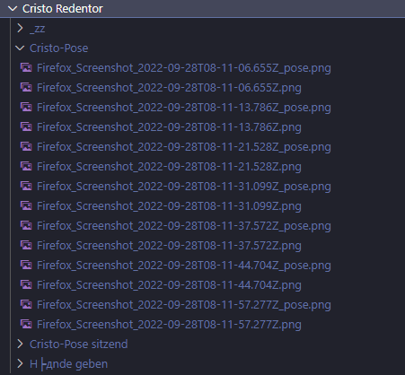
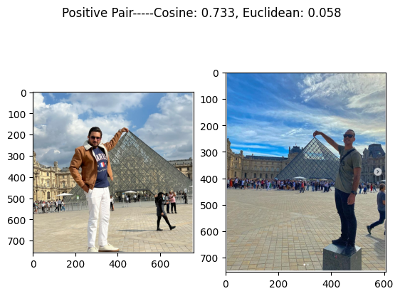
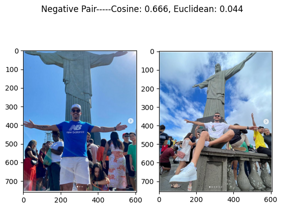

# InstaModel

## Table of Contents

- [About](#about)
- [Motivation](#motivation)
- [Ideas](#ideas)
- [Research Problem](#research)
- [Data Set](#data)
- [Methadology](#Methadology)
- [Getting Started](#getting_started)
- [Usage](#usage)
- [Contributing](../CONTRIBUTING.md)

## About <a name = "about"></a>
Identifying Role Models on Instagram 


## Motivation  <a name = "motivation"></a>
Instagram not only provides the scene 
to arrange places. Instagram also 
primes the way we look at them.

## Ideas  <a name = "ideas"></a>
Which posts sets a new arrangement of 
places that was copied by later posts?


## Research Problem <a name = "reserach"></a>
Develop a similarity measure based on 
certain features of image composition 
like pose recognition and background 
structure and evaluate it.

**Two images are classified as similar if they both have similar poses and same background**


## Data Set <a name = "data"></a>

The data set is scraped from instagram and contains images with various poses and sites. There are total **355** images from **14** different Sites across the world. 
These sites include:<br> 
`['Big Ben', 'Spinx', 'Kolloseum', 'Schiefer Turm von Pisa',
       'Taj Mahal', 'Cristo Redentor', 'Preikestolen', 'Louvre',
       'Brandenburger Tor', 'Oktoberfest', 'Eiffelturm', 'Las Vegas Sign',
       'Halfdome', 'Beverly Hills Park']`


Each of these sites have a number of different Poses, with multiple Examples per pose. Apart from the same poses, we also have images for each Site without any Pose in foreground. This can be helpful in training a model which can distinguiush between different Sites but Same Pose or vice versa. 

The dataset is organized in the following format. Each Pose has a separate folder. <br>





The Site `Cristo Redentor` has 3 different poses with each in their separate directory. <br>
**NOTE**: The folder `_zz` contains images of only the Site. <br>


## Methadology <a name = "Methadology"></a>

The project was carried out in two different parts. The first goal was to train a model which can distinguish between different images, without any specific pose estimation. In the later steps, the Pose information was also incorporated into the model. 

### Baseline 

Before training a custom model, a pretrained model, `ResNet50` was used to compute the feature vector of the images. The model returns a __2048__ long feature vector which is then used to compute the cosine similarity as well as the euclidean distance. The goal was to see if it would be feasible to assign some threshold to the cosine similarity and distances to figure out which images are similar. This methadology works for some images. <br>
> We can see quite high cosine similarity and very low eucildean distance, showing the two images are Similar (**Positive Pair**). <br>
 <br>

> Even though these images are different (Same site but different Pose), the Cosine similarity is quite high and distance too low. <br>
 <br>

Since the images are quite varied and there is considerable noise, this would not be a suitable approach. 


### Method 1: Siamese Network without Pose estimation

```
Siamese Network is an artificial neural network that uses the same weights while working in tandem on two different input vectors to compute comparable output vectors.
```

Siamese Networks can recognize similar images with only few training images. Since the dataset is quite limited, they are a good choice to perform this task. 


## Getting Started <a name = "getting_started"></a>

These instructions will get you a copy of the project up and running on your local machine for development and testing purposes. See [deployment](#deployment) for notes on how to deploy the project on a live system.

### Prerequisites

What things you need to install the software and how to install them.

```
Give examples
```

### Installing

A step by step series of examples that tell you how to get a development env running.

Say what the step will be

```
Give the example
```

And repeat

```
until finished
```

End with an example of getting some data out of the system or using it for a little demo.

## Usage <a name = "usage"></a>

Add notes about how to use the system.
