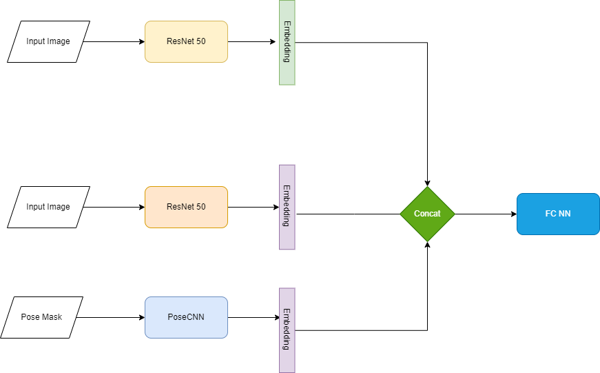

# InstaModel

## Table of Contents

- [About](#about)
- [Motivation](#motivation)
- [Ideas](#ideas)
- [Research Problem](#research)
- [Data Set](#data)
- [Methadology](#Methadology)
- [Getting Started](#getting_started)
- [Usage](#usage)
- [Contributing](../CONTRIBUTING.md)

## About 
Identifying Role Models on Instagram 

## Motivation  
Instagram not only provides the scene 
to arrange places. Instagram also 
primes the way we look at them.

## Ideas  
Which posts sets a new arrangement of 
places that was copied by later posts?

## Research Problem 
Develop a similarity measure based on 
certain features of image composition 
like pose recognition and background 
structure and evaluate it.

**Two images are classified as similar if they both have similar poses and same background**

## Data Set 

The data set is scraped from instagram and contains images with various poses and sites. There are total **355** images from **14** different Sites across the world. 
These sites include:  
`['Big Ben', 'Spinx', 'Kolloseum', 'Schiefer Turm von Pisa',
       'Taj Mahal', 'Cristo Redentor', 'Preikestolen', 'Louvre',
       'Brandenburger Tor', 'Oktoberfest', 'Eiffelturm', 'Las Vegas Sign',
       'Halfdome', 'Beverly Hills Park']`

Each of these sites have a number of different Poses, with multiple Examples per pose. Apart from the same poses, we also have images for each Site without any Pose in foreground. This can be helpful in training a model which can distinguiush between different Sites but Same Pose or vice versa. 

The dataset is organized in the following format. Each Pose has a separate folder.  

The Site `Cristo Redentor` has 3 different poses with each in their separate directory.  
**NOTE**: The folder `_zz` contains images of only the Site.  

#### **Preprocessing**

Since Siamese Networks work on pair images, positive and negative pairs were generated from the dataset. In theory, we can generate much more negative examples but in order to keep the dataset balanced, similar number of positive and negative examples were generated. Furthermore the pairs were split into training and validation set with 90-10 split. 

| Dataset  | Pair Type |  Number |
| ------------- | ------------- | ------------- |
| Training    | Positive Pairs  | 363  |
| Training   | Negative Pairs  | 369  |
| Validation   | Positive Pairs  | 44  |
| Validation   | Negative Pairs  | 38  |

The images were resized to __224x224__. Transformations like flipping, bringtness, contrast, saturation and hue changes were also added. More robust transformations like Afine transformations were not chosen since they can change the perspective of the image.

## Methadology 

The project was carried out in two different parts. The first goal was to train a model which can distinguish between different images, without any specific pose estimation. In the later steps, the Pose information was also incorporated into the model. Details of the two different models are given below. 

### Baseline 

Before training a custom model, a pretrained model, `ResNet50` was used to compute the feature vector of the images. The model returns a __2048__ long feature vector which is then used to compute the cosine similarity as well as the euclidean distance. The goal was to see if it would be feasible to assign some threshold to the cosine similarity and distances to figure out which images are similar. This methadology works for some images.  
> We can see quite high cosine similarity and very low eucildean distance, showing the two images are Similar (**Positive Pair**).  
  

> Even though these images are different (Same site but different Pose), the Cosine similarity is quite high and distance too low.  
  

Since the images are quite varied and there is considerable noise, this would not be a suitable approach. 

### **Method 1: Siamese Network without Pose estimation**

Siamese Network[[1]](#1) is an artificial neural network that uses the same weights while working in tandem on two different input vectors to compute comparable output vectors. 

Siamese Networks can recognize similar images with only few training images. Since the dataset is quite limited, they are a good choice to perform this task. 

####  **Training**

`ResNet50`[[2]](#2) was used as a backbone for the siamese network. Both complete network training as well only training the last layer was done. Both networks were trained for 100 epochs with a batch size of 24 and earlystopping based on Validation loss. Learning rate was set to 0.0001 and Stochastic Gradient Descent was used for training. To avoid overfitting, dropout layers were used in the FC network. Binary CrossEntropy was used as a loss function.

  

#### **Results**

This approach only performed well on images with almost similar poses with little background noise. If there is a change in perspective but the pose remains the same, it failed. The fully trained network was able to perform marginally better compared to the training the last layer only. 

| Network  | Input Size |  Validation Accuracy |
| ------------- | ------------- | ------------- |
| ResNet50 Last Layer+FCNN    | 224x224  | 58%  |
| ResNet50 Full+FCNN   | 224x224  | 65%  |

### **Method 2: Siamese Network with Pose estimation**

This method builds on top of the previos one. Instead of only using the Images, it also computes the poses from the image. OpenPose[[3]](#3) is used to compute the poses. 18 different keypoints are extracted from the image and used to make a skeleton. The poses along with the images are used by the siamese network. 

#### **Training**

During the preprocessing step, Open Pose is used to compute the poses and save the skeleton of the pose mask [[Figure 1]](#Figure1) Most of the images have people in the background too. It is quite challenging to only extract the pose of the subject. For this reason, we compute top two poses from the model and save them as a mask. 

  

For this approach, `ResNet50`[[2]](#2) was also used as a backbone for the siamese network. Both complete network training as well only training the last layer was done. Both networks were trained for 100 epochs with a batch size of 16 and earlystopping based on Validation loss. Learning rate was set to 0.0001 and Stochastic Gradient Descent was used for training. To avoid overfitting, dropout layers were used in the FC network. Binary CrossEntropy was used as a loss function. Another small CNN was used as a fetaure extractor for the Pose Images. 

  

#### **Results**

This approach was able to perform better than the vanilla Siamese Network without Poses. It was able to classify examples with different perspective but same poses. Previous approach failed for such examples. However it is still not able to identify the examples with extreme perspective shift or background noise correctly. The figure below shows the complete results of both methods.

| Network  | Input Size |  Validation Accuracy |
| ------------- | ------------- | ------------- |
| ResNet50 Last Layer+FCNN    | 224x224  | 58%  |
| ResNet50 Full+FCNN   | 224x224  | 65%  |
| ResNet50 Last Layer+FCNN+POSE    | 224x224 + 244x244 | 68%  |
| ResNet50 Full+FCNN+POSE  | 224x224 + 244x244 | 76%  |

## References

<a id="1">[1]</a> 
Koch, Gregory R.. “Siamese Neural Networks for One-Shot Image Recognition.” (2015).

<a id="2">[2]</a> 
He, Kaiming, et al. ‘Deep Residual Learning for Image Recognition’. CoRR, vol. abs/1512.03385, 2015, http://arxiv.org/abs/1512.03385.

<a id="3">[3]</a> 
Osokin, Daniil. ‘Real-Time 2D Multi-Person Pose Estimation on CPU: Lightweight OpenPose’. CoRR, vol. abs/1811.12004, 2018, http://arxiv.org/abs/1811.12004.